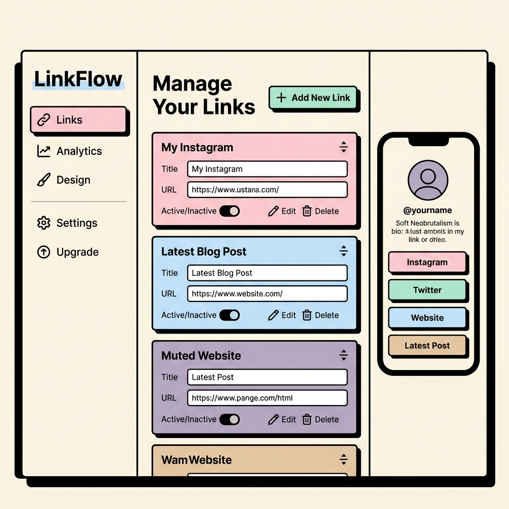

# PRD (Product Requirements Document) - 마이링크 (MyLink)

**버전**: v1.1  
**최근 수정일**: 2026-04-06

## 1. 프로젝트 개요
- **프로젝트명**: 마이링크 (MyLink)
- **목적**: 사용자가 여러 링크를 하나의 통합된 프로필 페이지에서 관리하고 공유할 수 있게 해주는 개인화된 링크 공유 플랫폼.
- **대상 사용자**: 크리에이터, 프리랜서, 소상공인 등 링크 통합 관리가 필요한 모든 사용자.

## 2. 핵심 기능 목록

### 2-1. 필수 기능 (MVP)
- [ ] **회원가입 및 로그인 (인증)**: 이메일 가입 및 소셜 로그인 (Supabase Auth).
- [ ] **프로필 및 닉네임 관리**: 유저의 **닉네임**과 **displayName** 설정 및 수정 가능.
- [ ] **닉네임 기반 URL 주소**: `도메인.com/닉네임` (또는 `/@닉네임`) 형태로 고유 페이지 제공.
- [ ] **링크 리스트 관리 (CRUD)**: 링크 목적지 URL과 타이틀 관리.
- [ ] **인라인 편집 (Inline Editing)**: 별도의 이동 없이 대시보드 내에서 즉시 닉네임, 프로필 정보, 링크 정보를 수정.

### 2-2. 선택 기능 (Advanced)
- [ ] **소셜 아이콘 전용 위젯**: 인스타그램, 깃허브 등 전용 아이콘 배치.
- [ ] **방문자 통계**: 개별 링크의 클릭 조회수를 기록하고 제공.

## 3. 각 기능의 상세 설명

### 3-1. 회원가입 및 사용자 인증
- 닉네임은 고유한 식별자로 사용되므로 가입 시 중복 체크가 필수입니다.

### 3-2. 링크 및 프로필 관리 (어드민 대시보드)
- **제한 사항**: **이미지 업로드 기능은 제공하지 않습니다.** (프로필 사진 등은 기본 아이콘이나 이니셜 등으로 대체)
- **인라인 편집**: 닉네임, displayName, 링크의 타이틀과 URL은 입력 필드를 클릭하여 그 즉시 수정할 수 있는 방식(Inline Edit)을 채택합니다.
- **링크 아이콘**: 구글 파비콘 API(`https://www.google.com/s2/favicons?domain=[도메인]&sz=64`)를 사용하여 입력된 목적지 URL에서 자동으로 아이콘을 호출합니다.

### 3-3. 퍼블릭 접속 페이지
- 사용자 닉네임을 경로(Path)로 사용하는 동적 라우팅을 구현합니다.

## 4. 기술 스택 및 데이터 모델링

### 4-1. 기술 스택
- **Backend/DB**: **Supabase**
- **Frontend**: **Next.js** (Tailwind CSS, Neobrutalism 스타일)

### 4-2. 데이터 모델링 (Supabase/PostgreSQL)

#### `profiles` (Table)
| Column | Type | Note |
| :--- | :--- | :--- |
| `id` | UUID (PK) | Supabase Auth UID 연동 |
| `nickname` | Text (Unique) | URL 경로로 사용됨 |
| `display_name` | Text | 실제 노출되는 이름 |
| `bio` | Text | 짧은 자기소개 |
| `updated_at` | Timestamp | 최종 수정 시간 |

#### `links` (Table - Sub-collection 개념)
*`profiles` 테이블의 `id`를 외래 키(FK)로 참조하는 테이블입니다.*
| Column | Type | Note |
| :--- | :--- | :--- |
| `id` | UUID (PK) | |
| `profile_id` | UUID (FK) | `profiles.id` 참조 |
| `title` | Text | 링크 제목 (인라인 편집 가능) |
| `url` | Text | 목적지 URL (인라인 편집 가능) |
| `click_count` | Integer | 추후 통계용 (기본값 0) |
| `created_at` | Timestamp | |

### 4-3. 전체 디자인 테마
- **소프트 네오브루탈리즘**: 파스텔톤 배경 + 굵은 검정 테두리 + 날카로운 그림자.

---

### 대시보드 디자인 목업

