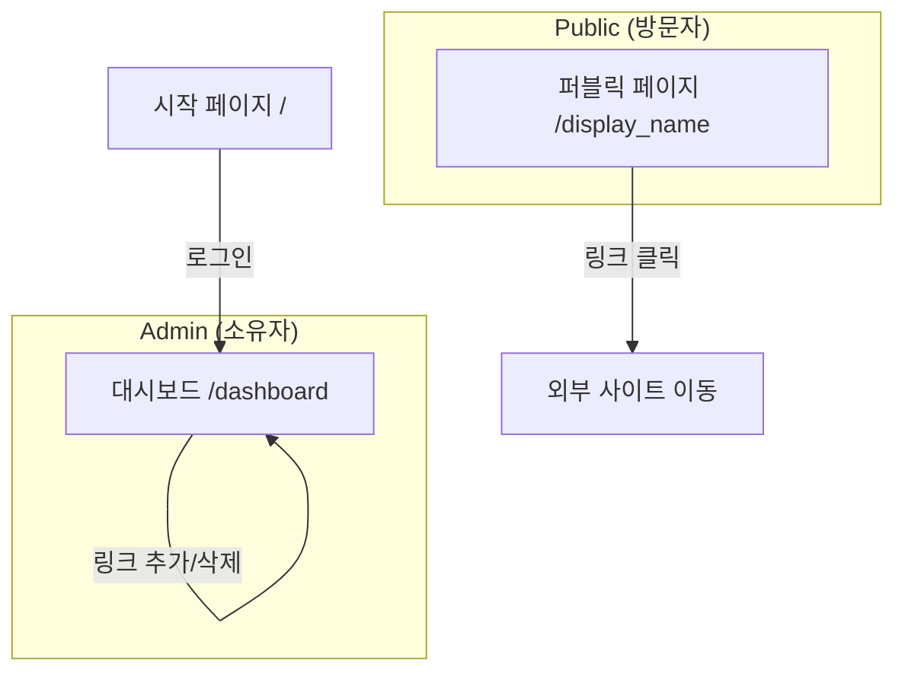

# 와이어프레임 (Wireframe) - 마이링크 (MyLink)

이 문서는 '마이링크'의 사용자 인터페이스(UI) 구조를 정의합니다. 소프트 네오브루탈리즘(Soft Neobrutalism) 테마를 바탕으로 설계되었습니다.

---

## 1. 서비스 흐름도 (Service Flow)



---

## 2. 퍼블릭 프로필 페이지 (Public Profile View)

방문자가 보게 되는 최종 페이지입니다. 중앙 정렬된 카드 형태의 링크들이 나열됩니다.

### [ASCII Wireframe]
```text
+---------------------------------------+
|              ( Logo )                 |
+---------------------------------------+
|                                       |
|          [ Profile Icon ]             |
|                                       |
|          # displayName                |
|          @username                    |
|          "Hello, this is my bio!"     |
|                                       |
|  +---------------------------------+  |
|  | [Icon]    Link Title 1      [>] |  |
|  +---------------------------------+  |
|  | [Icon]    Link Title 2      [>] |  |
|  +---------------------------------+  |
|  | [Icon]    Link Title 3      [>] |  |
|  +---------------------------------+  |
|                                       |
|          [ (M) MyLink LOGO ]          |
+---------------------------------------+
```

### [UI 구성 요소]
- **Profile Header**: 굵은 테두리의 원형 영역(이미지 업로드 대신 이니셜 노출).
- **Names**: `display_name`은 크게, `username`은 작게 표시.
- **Link Cards**: 
  - 파스텔톤 배경색.
  - 굵은 검정 테두리(2px~3px).
  - 오프셋 그림자(Sharp Shadow).
  - 좌측에 Google API를 통한 파비콘 아이콘 배치.

---

## 3. 어드민 대시보드 (Admin Dashboard)

소유자가 링크를 관리하는 화면입니다. 왼쪽은 편집 영역, 오른쪽은 실시간 미리보기 영역입니다.

### [ASCII Wireframe]
```text
+-------------------------------------------------------------+
| [M] MyLink Dashboard | [MyPage URL] | [Copy] | (Logout)     |
+-------------------------------------------------------------+
|                               |                             |
|  [ 편집 영역 (Editor) ]       |  [ 미리보기 (Preview) ]     |
|                               |                             |
|  1. 프로필 설정               |  +-----------------------+  |
|  +-------------------------+  |  |       (Mobile)        |  |
|  | Name: [ display_name ]  |  |  |   +---------------+   |  |
|  | Bio:  [ bio          ]  |  |  |   |    Profile    |   |  |
|  +-------------------------+  |  |   +---------------+   |  |
|                               |  |   | [ Link 1 ]    |   |  |
|  2. 링크 관리                 |  |   | [ Link 2 ]    |   |  |
|  +-------------------------+  |  |   +---------------+   |  |
|  | [ + 링크 추가 ]         |  |  |                       |  |
|  +-------------------------+  |  +-----------------------+  |
|                               |                             |
|  +-------------------------+  |                             |
|  | [=] Title: [ Title ]    |  |                             |
|  |     URL:   [ URL   ]    |  |                             |
|  |             [삭제]      |  |                             |
|  +-------------------------+  |                             |
|                               |                             |
+-------------------------------------------------------------+
```

### [UI 구성 요소]
- **Top Bar**: 현재 페이지 URL 확인 및 복사 기능, 로그아웃 버튼.
- **Editor Panel (Left)**:
  - 모든 텍스트는 클릭 시 바로 수정 가능한 **인라인 편집(Inline Edit)** 모드 지원.
  - 링크 카드 우측 하단에 휴지통 아이콘(삭제).
- **Preview Panel (Right)**:
  - 모바일 프레임 안에 실제 퍼블릭 페이지와 동일한 UI 렌더링.
  - **Sticky(고정)** 속성을 사용하여 스크롤 시에도 항상 우측에 노출.

---

## 4. Antigravity의 개선 제안

1.  **드래그 앤 드롭 (미래 대비)**: PRD에서는 제외되었으나, 추후 `유저 피드백`에 따라 링크 순서를 손쉽게 바꿀 수 있도록 라이브러리(dnd-kit 등) 도입을 고려한 레이아웃 설계를 완료했습니다.
2.  **성공/실패 토스트(Toast) 메시지**: 인라인 편집 특성상 "저장되었습니다"라는 명시적인 확인이 필요합니다. 네오브루탈리즘 스타일의 토스트 팝업을 설계에 포함합니다.
3.  **반응형 레이아웃**: 태블릿 이하 해상도에서는 미리보기 영역을 하단으로 내리거나 모달 형태로 띄워 편집 영역의 공간을 확보합니다.
